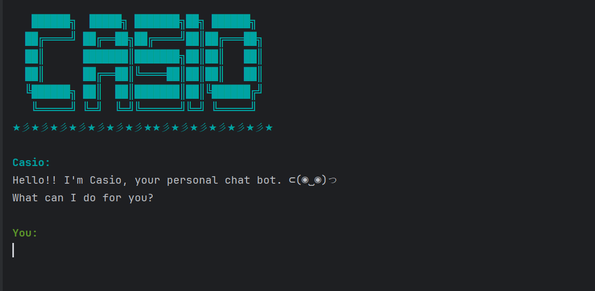

# Casio User Guide




Welcome to Casio, your personal chatbot task manager! 
Casio helps you stay organized with a variety of task management features.

## 📋 Listing tasks: `list`

List all tasks with their type and status.

Example of expected output:
```
Casio:
1. [T][X] todo1
2. [D][ ] deadline1 (by: 12 Dec 2024 12:30)
3. [E][ ] event1 (from: 12 Dec 2024 12:30 to: 12 Dec 2024 12:40)
You have 3 task(s).
```


## 📝 Adding ToDos: `todo`

Add ToDos to task list. ToDos are marked `[T]`.

Format: `todo todo_name`

Example: `todo Assignment`

Expected example output:
```
Casio:
Added todo: Assignment into the list.
You now have 1 task(s) in the list.
```

## ⏳ Adding deadlines: `deadline`

Add deadlines to task list. Deadlines are marked `[D]`.

Format: `deadline deadline_name /by date time`

Example: `deadline Assignment /by 12/12/2025 12:30`

Expected example output:
```
Casio:
Added deadline: Assignment (by: 12 Dec 2024 12:30) into the list.
You now have 1 task(s) in the list.
```

## 📅 Adding events: `event`

Add events to task list. Events are marked `[E]`.

Format: `event event_name /from start_datetime /to end_datetime`

Example: `event Lecture /from 12/12/2025 12:30 /to 12/12/2025 13:30`

Expected example output:
```
Casio:
Added event: Lecture (from: 12 Dec 2024 12:30 to: 12 Dec 2024 13:30) into the list.
You now have 1 task(s) in the list.
```

## 🗑️ Deleting tasks: `delete`

Delete tasks from task list based off their index on the list (index starts from 1).

Format: `delete task_index`

Example: `delete 1`

Expected example output:
```
Casio:
Deleted 1. [D][ ] Assignment (by: 12 Dec 2024 12:30)
You now have 0 task(s) in the list.
```

## ✔️ Marking tasks as complete: `mark`

Mark tasks as complete based off their index on the list (index starts from 1).

Tasks marked as done will be grayed out and have a [X] beside its name in the list.

Format: `mark task_index`

Example: `mark 1`

Expected example output:
```
Casio:
Assignment marked as done. Good job!!
```

## ✖️ Unmarking tasks: `unmark`

Unmark tasks based off their index on the list (index starts from 1).

Format: `unmark task_index`

Example: `unmark 1`

Expected output:
```
Casio:
Assignment marked as undone.
```

## 🔀 Sorting task list: `sort /by`

Sort the list of all current tasks by date and time using `sort /by time` command.

Sort the list of all current tasks by name (alphabetical order) using `sort /by name` command.

Expected example output:
```
Casio:
List is now sorted by date and time!
Enter 'list' command to see sorted list!
```

## 🔍 Finding tasks by name: `find`

Search for a tasks in the task list with a keyword. The results include each task's original index in the list.

Format: `find search_keyword`

Example: `find hello`

Expected example output:
```
Casio:
You have 2 search result(s):
1.[T][X] hello (Index on task list: 3)
1.[D][X] hello deadline (Index on task list: 5)
```

## 🏻 Filter tasks by type: `filter`

Filter tasks by a specified type from the task list. The results include each task's original index in the list.

Format: `filter todo/deadline/event`

Example: `filter todo`

Expected example output:
```
Casio:
You have 2 search result(s):
1.[T][ ] hello (Index on task list: 3)
2.[T][X] hello2 (Index on task list: 6)
```